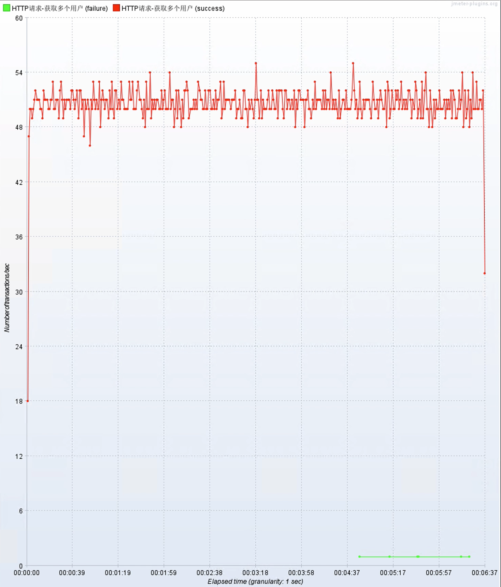

# 项目性能测试报告

## 测试目的

对用户列表接口的性能质量进行评估，若性能低下，寻找其性能瓶颈并给出修改方案

## 测试平台

JMeter 运行在 Windows Server 上，一台 4C8G 运行数据库，一台 4C8G 运行用户查询工程

## 测试环境

### 环境

同上，无其它组件的引入

| 指标 | 参数 |
|----|----|
| 机器 | 4C8G |
| 规模 | 数据库单机、应用单机 |
| 版本 | 0.0.1-SNAPSHOT |
| 数据库机器 | 4C8G |
| 数据库版本 | PostgreSQL 14 |

### 启动参数

`-Xms512M -Xmx512M`

## 测试场景

对用户检索接口进行验证，模拟用户并发逐渐增加的情形。接口响应时间未知。测试梯度：10、20、30、...、100线程，每30秒增加10线程，在线程数拉满后继续测试60秒。共计6分钟。

## 测试结果

### 第一次压测

压力测试当中，数据库服务器CPU负载超过4，TPS只有50，RT在100线程的压力下最终变为2秒。





### 测试复盘

瓶颈源于数据库，可能为数据库关键查询效率低下导致。

本项目使用了JPA，故添加`spring.jpa.show-sql=false`打印语句，发现关键语句（省略JPA生成的别名及分页内容）：

```sql
select * from users where upper("name") like upper(?);
```

对 `select * from users where "name" like 'Andy 0%'` 进行EXPLAIN，发现进行了全表扫描，`name`索引失效。

发现PostgreSQL默认btree索引不能进行前缀匹配的Like查询，故添加之，发现索引仍然失效，为函数导致。

PostgreSQL支持表达式索引，故添加之（见`scripts/create-upper-index.sql`）。

### 第二次压测

同第一次压测，但由于Windows并发连接数限制导致的socket占用使得失败率飙升，本次测试关闭了Keepalive。

结果，此次测试TPS接近5000，说明此优化具有明显效果。


最终，99线为51毫秒，最差响应为1480毫秒，平均响应时间为11毫秒。

## 测试结论

本次测试发现了一个由于PostgreSQL索引配置错误导致的性能问题。在看到接口容量的同时，也可以看到在大数据量、大并发数的基础下，数据库索引的配置问题会导致严重的性能问题。

-----

*此文档仅供学习交流使用*