# GC 测试

## 测试轮

使用 G1（512M 堆）进行测试，测试结果如下：

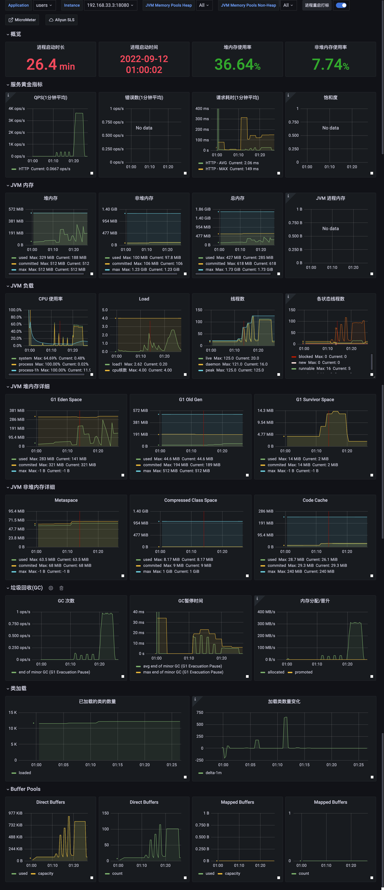

## 吞吐量优先

使用 PS+PO（256M 堆）进行测试，Grafana 截屏如下：

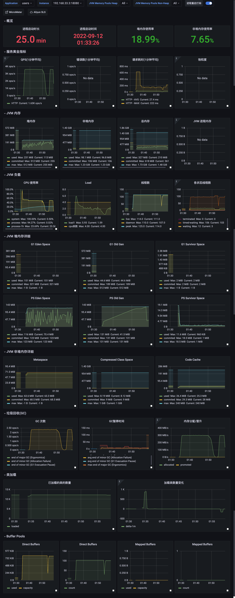

其中，进行了一次 99 秒的 FullGC，日志如下：

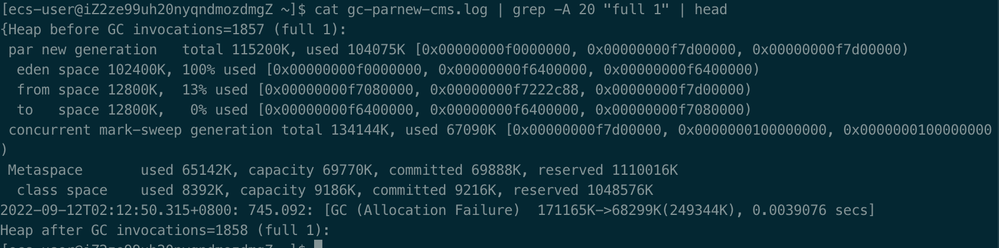

此次 GC 接近 100 ms，导致了用户可见的延迟：

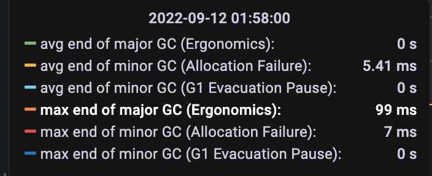

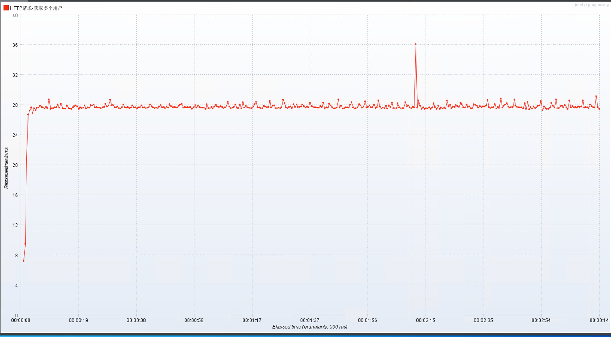

特别注意的是，JMeter 在此次压测中 OOM 了，导致了部分信息缺失：

最终吞吐量如图（只有 3 分钟图表意义不大），在 3500 左右，此次测试几乎全部在 3500 左右：

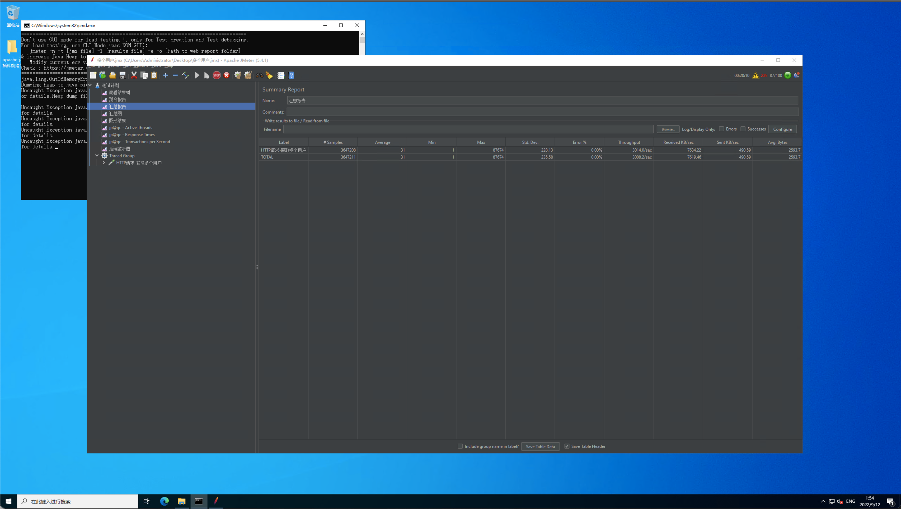

## 响应优先

使用 ParNew+CMS（256M 堆）进行测试，Grafana 截屏如下：

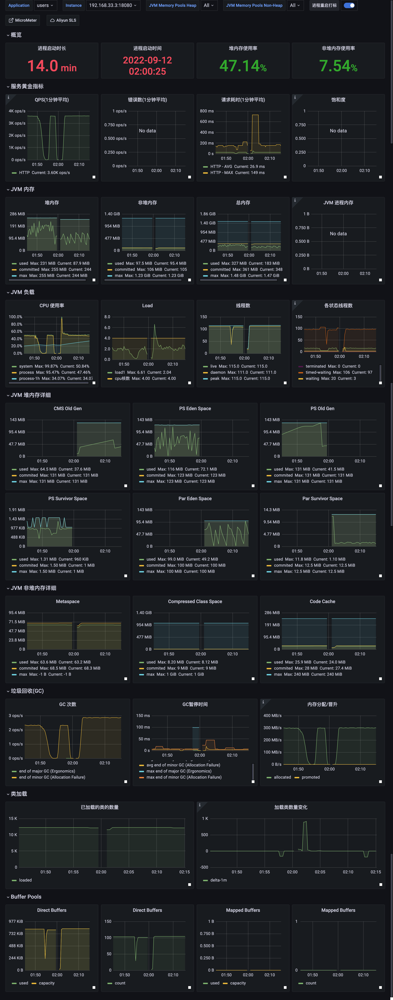

发生了一次 FullGC，但是在 Grafana 中没有任何记录，用户端无感知。

响应时间如下（吞吐量仍然是 3500 左右）：

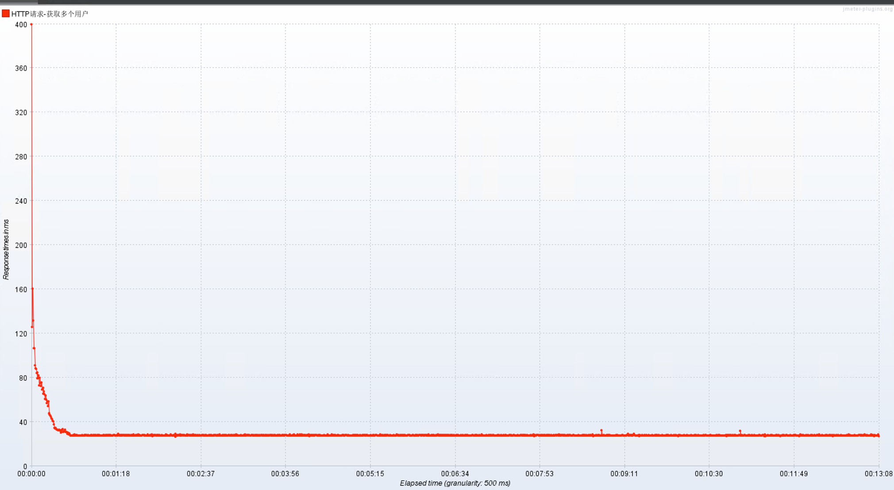

## G1

使用 G1（256M 堆）进行测试，Grafana 截屏如下：

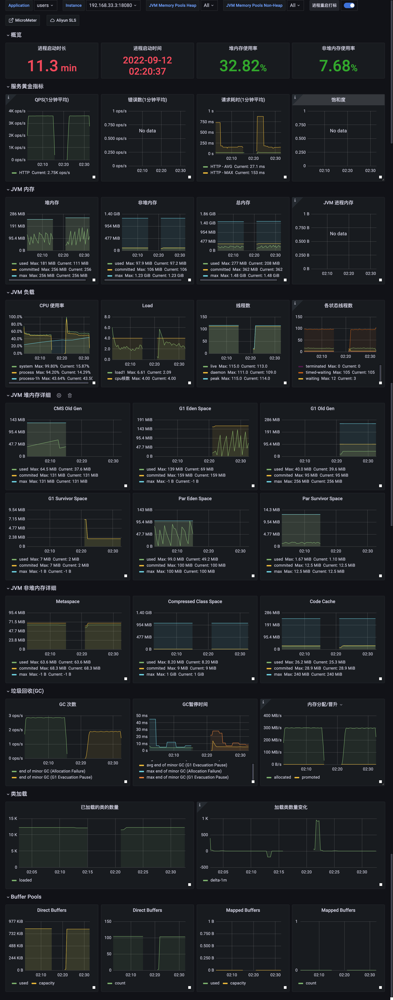

响应时间和吞吐量如下：

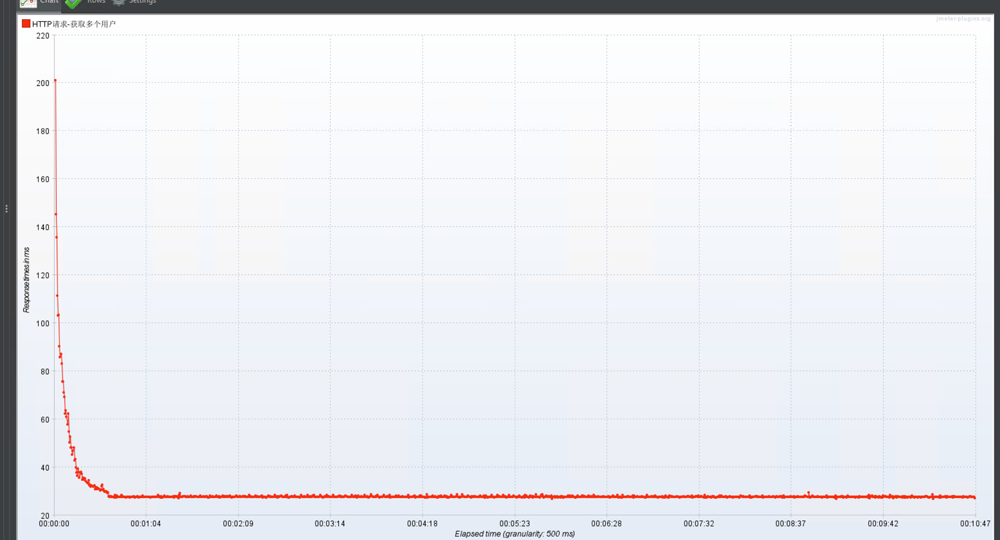

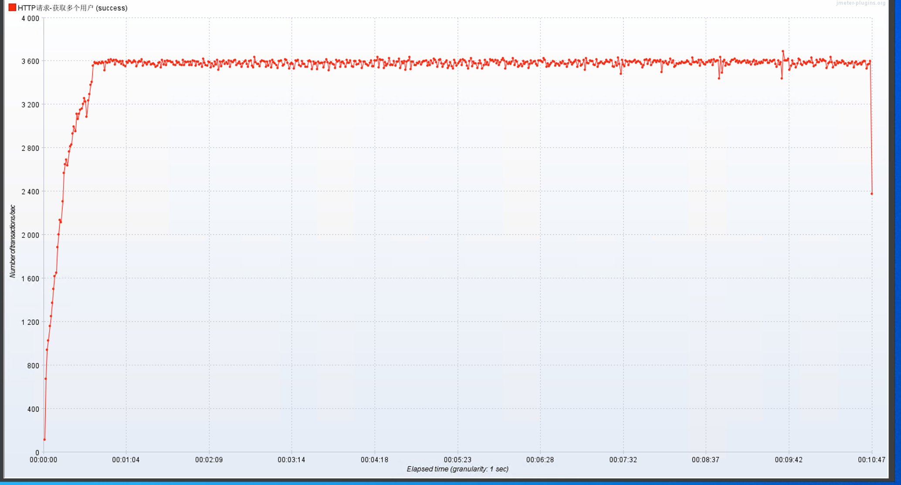

# 结论

实际上，根据上述结果，无法得出任何结论。在当前场景下，G1 更好一些，这种“更好”也是从 PS+PO 的 FullGC 对用户可感知的角度出发的（实际上，CMS 的 CPU 占用相比 G1 更低一些，性能也相差无几）。

根据上述结论，在 JDK 8+ 环境下，建议不要在调优之前（项目开发时期）使用 PS+PO，甚至建议直接使用 G1，根据 G1 的表现，可以看出当前业务场景下，G1 的 FullGC 可能在 24 小时内都不会发生（ParNew+CMS 发生了一次 FullGC，但影响不大）。

对垃圾回收器的选择，必须根据业务场景进行各自判断；同时，GC 应该是比较靠后的调优方式，效率低下的数据库查询和不合理的缓存设计（例如没有缓存）可能是导致性能糟糕的更明显的原因；另外，GC（特指 FullGC）导致的性能问题有着非常明显的特征，而 FullGC 性能问题是必须优先解决的（在大堆上 FullGC 会导致长时间服务不可用）。